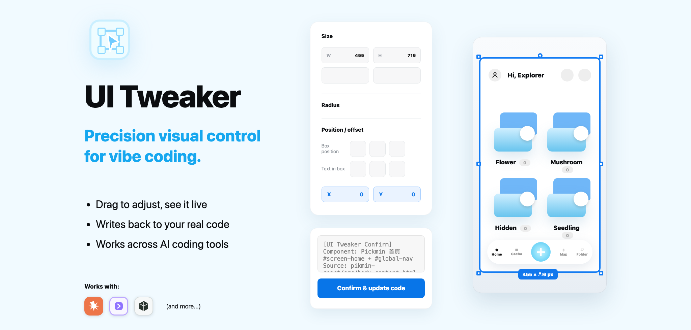

# UI Tweaker — 精準視覺控制，為 vibe coding 而生。

[English README](./README.md)

用 **AI coding assistant** 搭配設計工具風格的控制面板微調任何 UI 元件——刷數值、即時預覽、移動與縮放元素——調好按下**確認**,AI 就把數值**直接寫回你的真實原始碼**。不用再來回「大一點…不對再小一點…再圓一點」。



> **狀態:** v1.1.0 · MIT 授權 · 已包裝給 Claude Code,也提供 Codex、Cursor、Windsurf 與純 skill folder 安裝用的 portable adapters。

---

## 為什麼

用文字叫 AI 調 UI(「padding 多一點」「沒那麼圓」)很耗回合在猜數字。UI Tweaker 反過來:AI assistant 用**你真實的樣式表**渲染一個**即時控制面板**,你用視覺調整,按**確認**,精確的結構化數值就送回去給 AI 套用並驗證。

核心原則:**每個調整都是可回填的結構化數值**——不是憑感覺。

## 功能

- **真實樣式,不用猜** — 預覽連結你專案的**真實 CSS**,初始值用 `getComputedStyle` 讀,所見即上線結果(含多層 `!important` 覆寫)。
- **三欄工作區** — Layers 樹(元件原子化拆解)· 即時預覽 · 控制面板。
- **八大控制分類** — 字型、間距、尺寸、圓角、位置偏移、陰影、磨砂玻璃、顏色。
- **Figma／PS 操作** — 可打字數字框、拖曳刷值、圓角四角連動、圖示對齊、undo/redo + 鍵盤快捷鍵。
- **變形框** — 選任何元素都給 8 手把框:角=等比縮放、邊=改寬高、框內拖移、旋轉手把、即時 px 標籤。
- **寫回原始碼** — 按確認後,AI 解析數值、找到對應 selector、改真實檔案、再驗證(例如跑 build／檢查 computed style)。

## 安裝

這個 repo **同時是** Claude Code plugin marketplace **也是**可攜式 skill package。可攜式 package 由 [`skill.json`](./skill.json) 描述，並透過 [`scripts/`](./scripts/) 內的腳本同步到不同 AI 工具。

### 方式 A — Claude Code plugin(推薦,可自動更新)

```
/plugin marketplace add dhosruiasn/ui-tweaker
/plugin install ui-tweaker
```

日後更新:重新整理 marketplace 再安裝一次,就會拿到你 push／打 tag 的最新版。

### 方式 B — portable adapters

```
git clone https://github.com/dhosruiasn/ui-tweaker.git
cd ui-tweaker
scripts/install --target codex
scripts/install --target cursor --dest /path/to/project
scripts/install --target windsurf --dest /path/to/project
```

支援目標:

- `codex` — 把 `skills/ui-tweaker/` 安裝成 skill folder。
- `cursor` — 建立 `.cursor/rules/ui-tweaker.mdc`，並同步 skill folder 到 `.cursor/skills/ui-tweaker`。
- `windsurf` — 建立 `.windsurf/rules/ui-tweaker.md`，並同步 skill folder 到 `.windsurf/skills/ui-tweaker`。
- `portable` — 複製或 symlink skill folder 到你指定的位置。

預設是 copy；如果想讓本地 package 的修改立即反映到 adapter 目標，可加 `--link`。

更新:

```
scripts/update --dry-run
scripts/update
scripts/install --target cursor --dest /path/to/project
scripts/publish -m "Update UI Tweaker"
scripts/doctor
```

`scripts/update` 需要此資料夾是 Git checkout。更新前會備份目前 package，只做 fast-forward update，且不執行下載來的程式碼。更新後請重新跑一次 `scripts/install`，把新版同步到各 adapter 目標。

發布採手動設計。`scripts/publish` 會 stage package 變更、必要時建立 commit，然後把目前分支 push 到 `origin`；它不會安裝背景自動 push hook。

## 使用方式

直接用白話講:

> 「幫我調整卡片元件」·「我想調這個按鈕的 padding」·「這個感覺太擠」

你的 AI assistant 會:
1. 把 `skills/ui-tweaker/template/panel-template.html` 複製到你專案旁(以瀏覽器能開啟的方式提供)。
2. 用你真實元件填入 `PROJECT-SPECIFIC` 標記(連結樣式表、貼真實 DOM、建 Layers 樹)。
3. 開控制面板。你調整 → **確認**。
4. AI 把結構化數值套到原始碼並驗證。

## 固定樣板怎麼運作

`skills/ui-tweaker/template/panel-template.html` 是**凍結的 UI**。每個專案拿到完全一樣的面板,只換標記為 `PROJECT-SPECIFIC` 的地方:

| 標記 | 內容 |
| --- | --- |
| `#1` | `<title>` |
| `#2` | 字體 `<link>`(你專案的字體) |
| `#3` | 樣式表 `<link href>`(你的真實 CSS——禁止手抄數值) |
| `#4` | 預覽 DOM(你真實元件 markup,每個原子元素加 `data-pick`) |
| `#5` | `SEL` map(pick key → widget 內查詢用 selector) |
| `#6` | `OUT_SEL` map(pick key → 確認輸出用的 CSS selector) |
| `#7` | `LAYERS` 樹(你的 DOM 拆到原子層級) |
| `#8` | 確認輸出的「元件／來源」字串 |
| `#9` | 元件舞台 reset CSS——只有當你的真實元件在 production 是隱藏/絕對定位時才需要 |

其餘(版面、CSS、builder JS)byte-for-byte 一字不動。完整規格見 [`SKILL.zh-TW.md`](./skills/ui-tweaker/SKILL.zh-TW.md)。

樣板出廠時已接上 [`examples/demo.css`](./examples/demo.css) 的通用 demo 元件,你可以直接打開 `skills/ui-tweaker/template/panel-template.html` 看面板運作,再接自己的專案。

## 回饋與貢獻

- 🐞 **Bug／需求** → [開 issue](https://github.com/dhosruiasn/ui-tweaker/issues)(有模板)。
- 💬 **問題／點子** → [開 issue](https://github.com/dhosruiasn/ui-tweaker/issues/new/choose)。
- 歡迎 PR — 見 [`CONTRIBUTING.md`](./CONTRIBUTING.md)。

## 授權

[MIT](./LICENSE) © 2026 HsuanTung Kao
